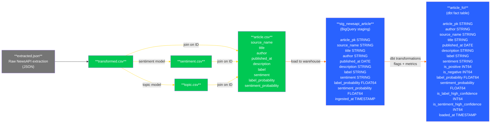
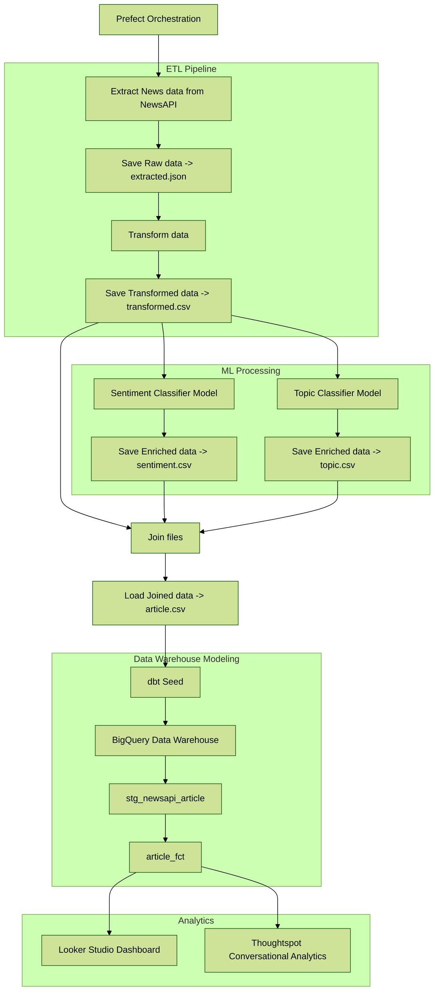
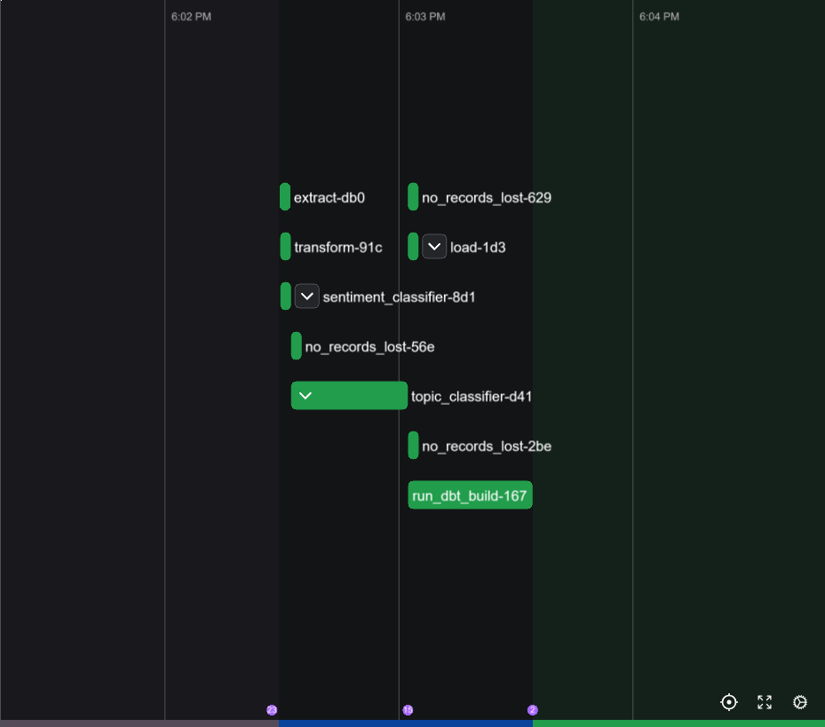
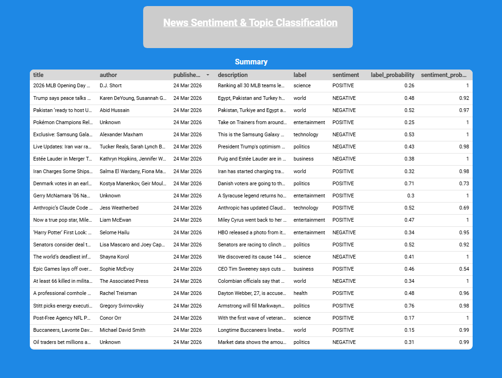
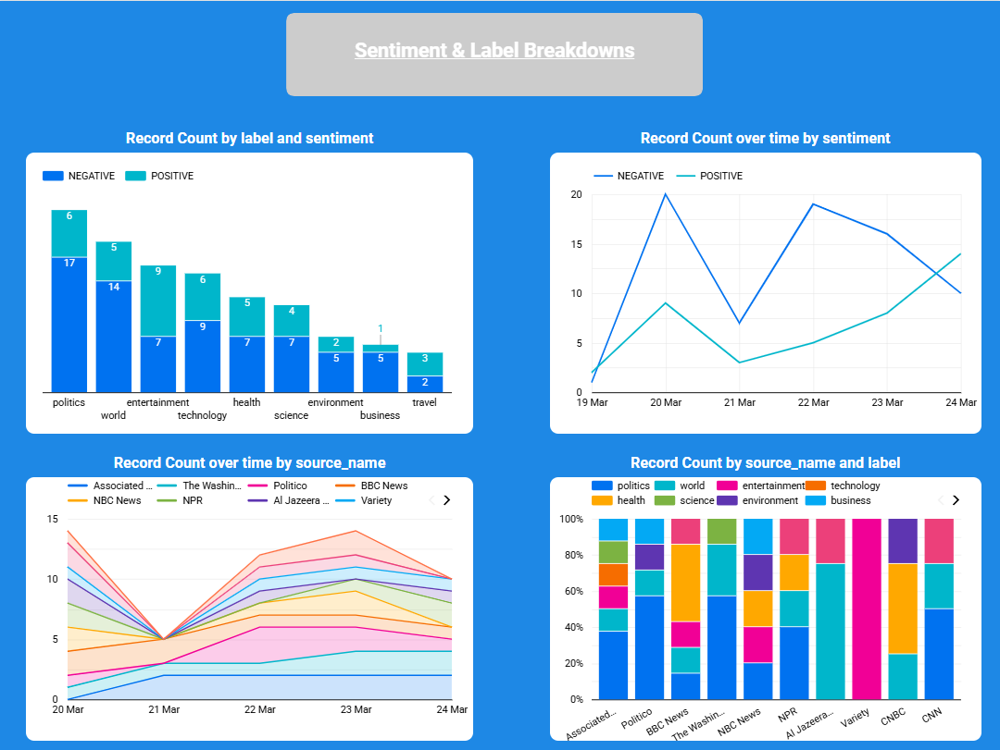
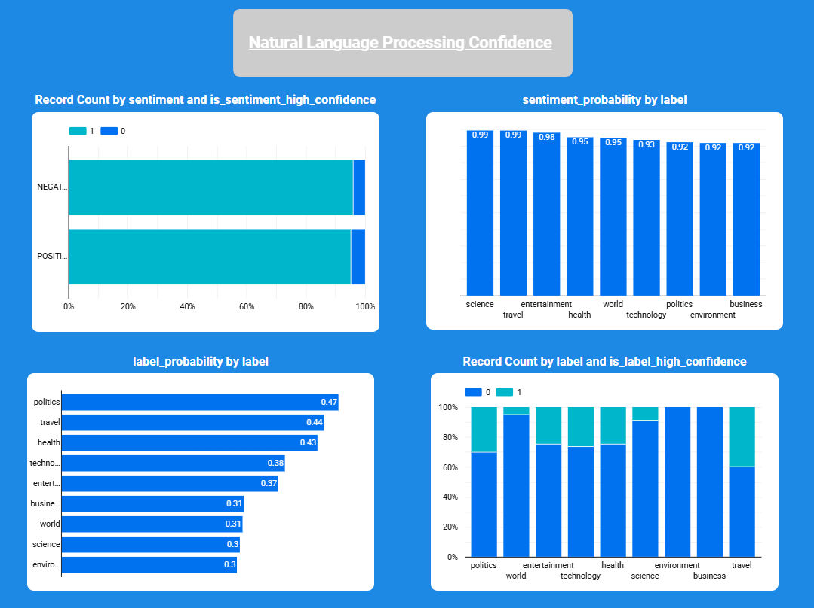

# AI Enhanced Analytics

## Overview

This project showcases a complete orchestrated ETL/NLP pipeline which takes raw news data from an API and enriches the data by
assigning a sentiment and topic label to each article description, which can be explored through natural language or via the dashboard. 

## Natural Language Processing 

For the Natural Language Processing aspect of my project, I utilised two open-source models which can be found on Hugging Face https://huggingface.co, an AI community platform. Both models were selected due to their relative leanness, as loading large models onto my computer would not have been possible, and when deployed on Prefect Cloud, would have massively increased compute time due to the initial load.

- **Text Classification:** Article descriptions were passed through the open source 'distilbert/distilbert-base-uncased-finetuned-sst-2-english' model to assign a sentiment.
- **Zero-Shot Classification:** Article descriptions and a list of labels were passed through the open source 'tasksource/deberta-small-long-nli' to assign a label.

## Conversational Analytics

For the Conversational Analytics aspect of my project, I opted to trial ThoughtSpot, a BI platform which allows you to ask questions of your data in natural language and receive in-depth analysis. Utilising Conversational Analytics further encouraged me to keep my data model simple to ensure no joins could be misinterpreted, and the location of required fields would be easy.

When designing a data model for use via Conversational Analytics, I would recommend a simple star schema or a single denormalised wide table if feasible, rather than breaking out columns into many normalised tables. Unfortunately sharing access to my ThoughtSpot instance would be a security risk and could incur a cost to my GCP account, so I have put together a Looker Studio dashboard which can be found in the Dashboard section below, where you can view my analysis.

### Demo

[](https://res.cloudinary.com/dmeh864ji/video/upload/v1774557197/Recording_2026-03-26_203257_dmazp7.mp4)

## Use Case
A sentiment and topic classification pipeline could be utilised by large digital native companies that receive high volumes of customer reviews. It will allow them to better understand pain points customers are encountering with their products and services to identify areas of their business that require investment and improvement.

## Dataflow & Model

Data model was deliberately kept simple as it was unecessary to split data out into a star schema due to their being few dimensions, and given that Conversational Analytics has the highest accuracy when querying a single table. If your interested in seeing a star schema implementation I have done, please view this project https://github.com/Ethan07914/StockMarketAnalytics.

### Dataflow



### DDL 

```SQL
CREATE TABLE
 stg_newsapi_article
( article_pk STRING,
  source_name STRING,
  title STRING,
  author STRING,
  published_at DATE,
  description STRING,
  label STRING,
  sentiment STRING,
  label_probability FLOAT64,
  sentiment_probability FLOAT64,
  ingested_at TIMESTAMP );
```

```SQL
CREATE TABLE
 article_fct
( article_pk STRING,
  author STRING,
  source_name STRING,
  title STRING,
  published_at DATE,
  description STRING,
  label STRING,
  sentiment STRING,
  is_positive INT64,
  is_negative INT64,
  label_probability FLOAT64,
  sentiment_probability FLOAT64,
  is_label_high_confidence INT64,
  is_sentiment_high_confidence INT64,
  loaded_at TIMESTAMP
);
```

## Pipeline

- Data requested from News API via Python script and saved to JSON file
- Data transformed and unnested from dictionaries using Pandas and saved to a CSV file
- Data enriched by a Sentiment Classifier model and saved to CSV
- Data enriched by a Topic Classifier model and saved to CSV
- CSVs converted to Data Frames, joined, and saved to a singular CSV file
- CSV file seeded via dbt core onto Google Cloud
- Surrogate keys generated in staging dbt model
- New fields derived in warehouse dbt model
- Entire pipeline alongside testing orchestrated using Prefect Cloud
 

## Tech Stack 

- **Pipeline:** Python (pandas), dbt (dbt-core, dbt-bigquery).
- **Natural Language Processing:** Transformers (Hugging Face),  PyTorch.
- **Orchestration:** Prefect Cloud.
- **Data Warehouse:** BigQuery.
- **Analytics:** ThoughtSpot, Looker Studio.

## Orchestration & CI/CD 

 I selected Prefect as my orchestrator due to the generous free tier and simple setup. Configuring Prefect did not require me to restructure my project or write additional code; it worked out of the box; I just had to specify if a function was the main flow (entrypoint) or just a task. 
 
 Using other orchestrators would have meant dramatic restructuring of the project, many lines of additional code, and even changing system settings on my computer. Not to mention, they would likely come with additional costs for hosting and compute resources.
 It was also easy to connect my GitHub repo to Prefect Cloud and set up a daily cron job via CLI to automate the entire workflow.

- **Orchestration:** Pipeline runs daily at 18:00 via Prefect Cloud.
- **CI/CD:** Prefect Cloud clones the GitHub repository before every run to ensure new changes to the pipeline are introduced.



## Dashboard 

New data can be viewed in the dashboard after 18:00 every day.

- **Dashboard:** A publicly accessible three-page dashboard was created with Looker Studio
- **Link:** https://lookerstudio.google.com/u/1/reporting/34403f0c-3597-4d2d-a69d-7af99cfbe5cf/page/IdtsF

### Page 1


### Page 2


### Page 3

