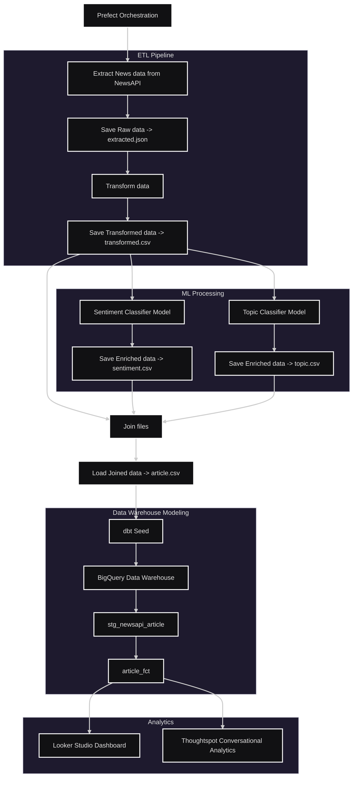

# AI Enhanced Analytics

## Overview

This project showcases a complete orchestrated ETL/NLP pipeline which takes raw news data from an API and enriches the data by
assigning a sentiment and topic label to each article description which can be explored through natural language or via dashboard. 

## Natural Language Processing 

- **Text Classification:** Article descriptions where passed through the open source 'distilbert/distilbert-base-uncased-finetuned-sst-2-english' model to assign a sentiment.
- **Zero-Shot Classification:** Article descriptions and a list of labels where passed through the open source 'tasksource/deberta-small-long-nli' to assign a label.

## Conversational Analytics

[

## Dataflow
 

## Tech Stack 

- **Pipeline:** Python (pandas), dbt (dbt-core, dbt-bigquery).
- **Natural Language Processing:** Transformers (Hugging Face),  PyTorch.
- **Orchestration:** Prefect Cloud.
- **Data Warehouse:** BigQuery.
- **Analytics:** ThoughtSpot, Looker Studio.

## Orchestration & CI/CD 

- **Orchestration:** Pipeline runs daily at 18:00 via Prefect Cloud.
- **CI/CD:** Prefect Cloud clones the GitHub repository before every run to ensure new changes to the pipeline are introduced.
- **Setup:** Prefect integrated well with my existing project structure, code and worked out of the box after I installed the package via pip.
- **Workflow Automation:** It was easy to connect my GitHub repo to Prefect Cloud and set up a daily cron job via CLI to automate the entire workflow.
- **Other Orchestrators:** Alternatively, Airflow could have been used; however requires additional code and would have been more costly to run via Google Cloud Composer.

## Dashboard 

- **Dashboard:** A public three-page dashboard was created with Looker Studio 
- **Link:** https://lookerstudio.google.com/u/1/reporting/34403f0c-3597-4d2d-a69d-7af99cfbe5cf/page/IdtsF

